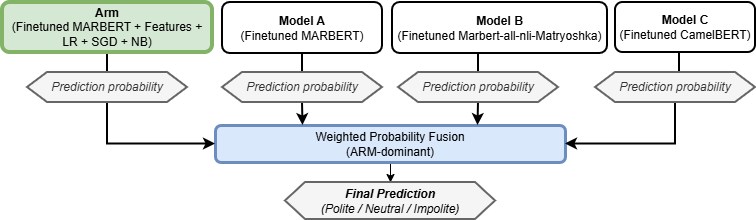
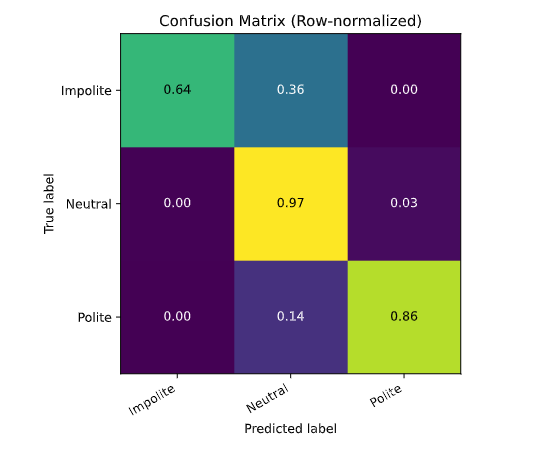

<h2 align="center">MOSKA-NLP at AdabEval 2026: Feature-Enriched Ensembling for Arabic Politeness Detection</h2>

  <b>2nd Place – AdabEval 2026 (Subtask A)</b>

  
  
  

---

## 📰 Overview

This repository contains our system for **Arabic politeness classification** (Polite / Neutral / Impolite) submitted to **AdabEval 2026 (Subtask A)**.

Our approach combines:
- sentence embedding backbones
- feature enrichment (lexical + pragmatic + auxiliary signals)
- ensemble learning with class-specific thresholding

📊 Final performance:
- **Macro-F1: 0.87**
- **Accuracy: 93%**
- **Rank: 2nd place**

---

## 🧠 System Overview

The system consists of a **primary classification arm** combined with **auxiliary models**, using weighted probability fusion and thresholding.

---

## ⚙️ Pipeline Summary

| Component | Description |
|----------|------------|
| Arm | MARBERTv2 (fine-tuned)|
| Features | Manual + automatic lexical, surface, pragmatic |
| Classifiers | Logistic Regression, SGD (calibrated), ComplementNB |
| Ensemble | Weighted probability fusion |
| Imbalance Handling | Class-specific thresholds |

---

## 🧩 Feature Enrichment

Feature enrichment is the **main driver of performance**, contributing the largest gain (+0.05 macro-F1).

---

### 🔹 Feature Categories

| Feature Group | Description | Motivation |
|--------------|------------|-----------|
| **Manual Lexical (MNL)** | Curated politeness markers, insults, honorifics, addressee terms | Explicit linguistic signals |
| **Automatic Lexical (Auto)** | Class-specific keywords from training data | Dataset adaptation |
| **Normalization (CLN)** | Alef/ya normalization, diacritics removal, repetition reduction | Reduce orthographic noise |
| **Elongation (ELG)** | Character repetition (e.g., "جميييل") | Emphasis and affect |
| **Pragmatic (PRG)** | Emoji, punctuation, exclamation/question patterns | Tone and informal signals |
| **Auxiliary Signals (IDS)** | Dialect, intent, sarcasm predictions | Contextual semantics |
| **Source (SRC)** | Data source metadata | Domain variation |

---

### 🔹 Manual Lexical Features

Examples:
- Politeness: "شكراً", "من فضلك"
- Honorifics: "دكتور", "أستاذ"
- Addressee: "يا أخي"
- Insults: "فاشل", "كذاب"

Only high-specificity terms (>0.75) are retained.

📌 Insight:
> Strongest individual feature group (+5.5 F1)

---

### 🔹 Automatically Derived Lexicons

Extracted using:
- frequency ≥ 10
- class dominance ≥ 0.75
- removal of global stopwords (>5%)

Result:
- Polite: ~29  
- Neutral: ~351  
- Impolite: ~5  

📌 Insight:
> Useful but weaker than manual features

---

### 🔹 Surface & Pragmatic Signals

- Elongation → emphasis  
- Emojis & punctuation → tone  
- Diacritics → stylistic cues  

📌 Insight:
> Improve performance when combined with lexical features (+6.38 F1)

---

### 🔹 Auxiliary Models

We incorporate predictions from pretrained models:

- **Dialect**  
  https://huggingface.co/IbrahimAmin/marbertv2-arabic-written-dialect-classifier  

- **Intent**  
  https://huggingface.co/bassemessam/Arabic-bank77-intent-classification  

- **Sarcasm**  
  https://huggingface.co/hardiksr/sarcasm-classifier-bert-base-arabic-camelbert-msa-data  

These are used as **features**, not direct predictors.

📌 Insight:
> Helpful only when combined with lexical signals (+6.90 F1)

## 📊 Performance Progression

| Stage | Split | Macro-F1 | Accuracy (%)|
|------|------|---------|----------|
| Frozen MARBERTv2 | Valid | 0.753 | 85 |
| Frozen Matryoshka | Valid | 0.797 | 87 |
| + Feature Enrichment | Valid | **0.845** | 90 |
| Fine-tuned MARBERTv2 | Valid | 0.847 | 90 |
| + Feature Enrichment | Valid | 0.853 | 91 |
| + Classification Arm | Valid | 0.859 | 92 |
| Ensemble (dev) | Valid | 0.862 | 92 |
| **Final System** | Test | **0.87** | **93** |

📌 Key takeaway:
> Feature enrichment yields the largest improvement

---

## ⚠️ Error Analysis

### 🔹 Error Patterns

| Error Type | Rate |
|----------|------|
| Impolite → Neutral | 36% |
| Polite → Neutral | 14% |
| Neutral accuracy | 97% |

📌 Insight:
> The model tends to **default to Neutral under ambiguity**, especially when explicit markers are absent.

---

### 🔹 Representative Errors

- **Impolite → Neutral (implicit dissatisfaction)**  
  *"خدمة جدا سيئة وتحديث لافائدة منه"*  
  → “Very bad service and the update has no benefit.”  
  ➤ No explicit insult → predicted as Neutral

- **Polite → Neutral (implicit politeness)**  
  *"خدمه ممتازه وافتخر بأني من عملاءه"*  
  → “Excellent service, and I’m proud to be a customer.”  
  ➤ Positive tone without explicit politeness.

- **Neutral → Polite (soft requests / encouragement)**  
  *"اتمنى الحلقة تترجم"*  
  → “I hope this episode gets translated.”  
  ➤ Interpreted as polite request, labeled Neutral
